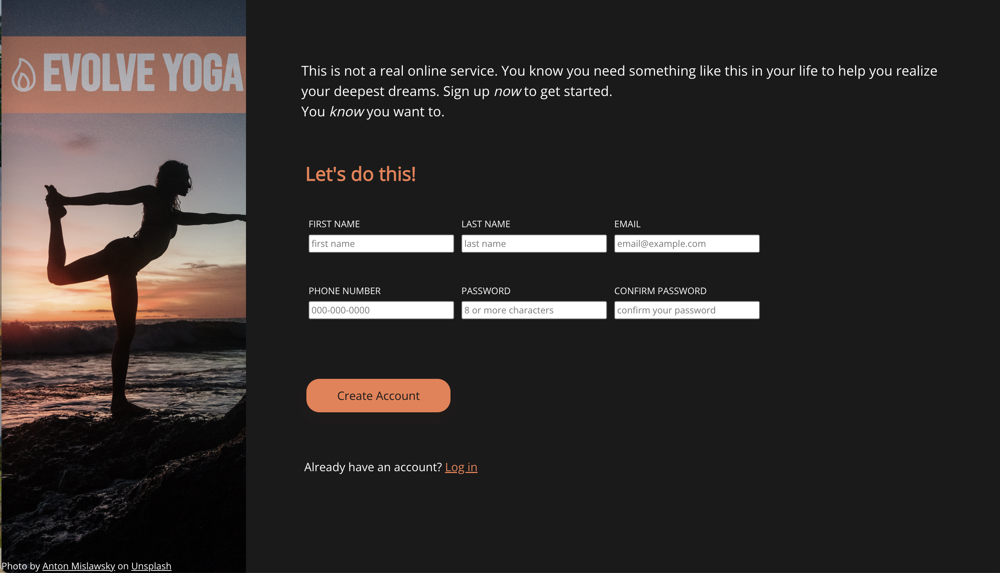

# Sign-up-Form
project for The Odin Project

This is a Sign-up-Form project inspired by [The Odin Project](https://www.theodinproject.com/)

## Table of contents

- [Overview](#overview)
  - [Concept](#the-challenge)
  - [Screenshot](#screenshot)
  - [Links](#links)
- [My process](#my-process)
  - [Built with](#built-with)
  - [What I learned](#what-i-learned)
  - [Continued development](#continued-development)
  - [Useful resources](#useful-resources)
- [Author](#author)

## Overview

### Concept
Create a sign-up form for an imaginary service.

### Screenshot

### Links

- [Live Site URL](https://kure-ru.github.io/Sign-up-Form/)

## My process

### Built with

- HTML5
- CSS3
- Javascript

### What I learned

* CSS
- [clamp()](https://developer.mozilla.org/en-US/docs/Web/CSS/clamp)
- [CSS Buttons](https://www.w3schools.com/css/css3_buttons.asp)
- [:invalid](https://developer.mozilla.org/en-US/docs/Web/CSS/:invalid)

### Continued development

- I would like to improve the UI by writing a program to detect if the passwords are matching in JavaScript.

### Useful resources
- [ionic](https://ionic.io/ionicons)

## Author

- [Claire](https://github.com/Kure-ru)

  
